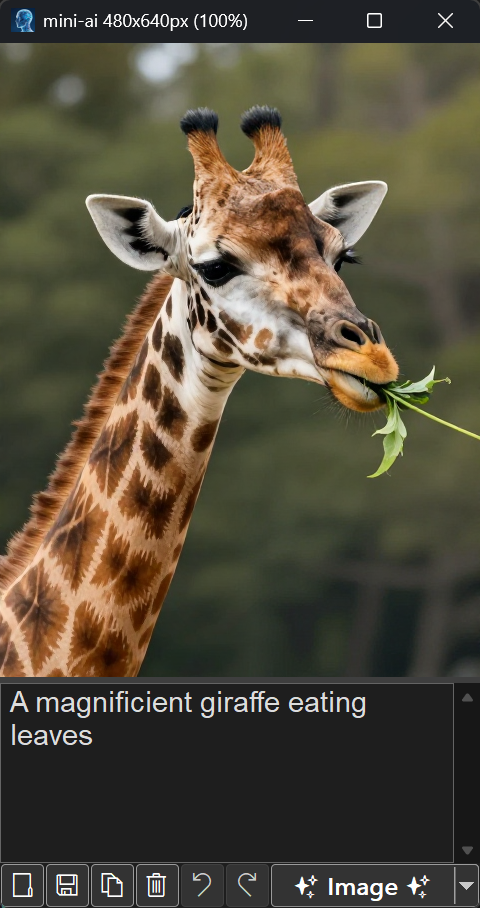
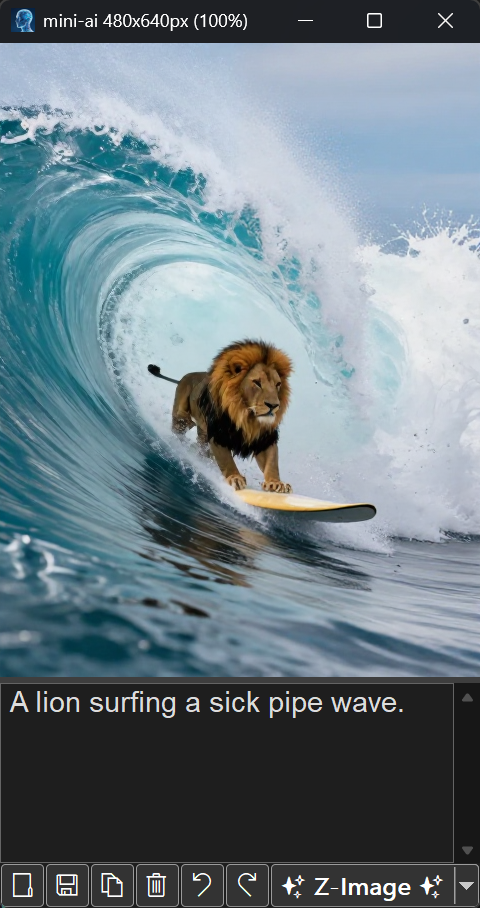
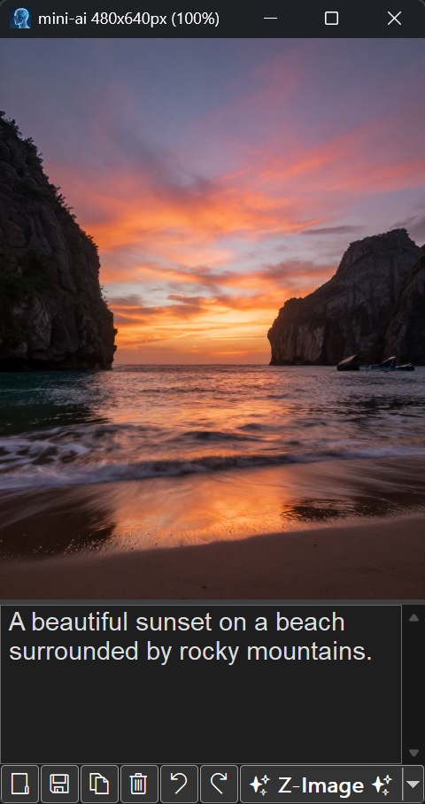
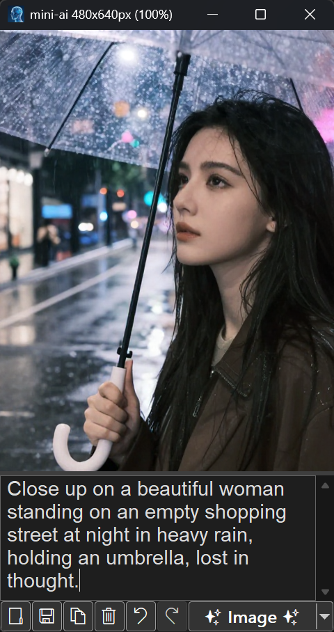

# Mini-AI 
A super simple graphical application for easy AI generation tasks locally on your machine.
Made in C++ and WinAPI, no external dependencies.

   

## Features
- Image generation from text: You simply type a text and the image will be generated above. Supported AI models:
    - Z-Image Turbo
    - Flux 2 Klein
    - Stable Diffusion 3.5 Large
- Image Editing: Edit the current image (that was generated or opened) with a text description
    - Flux 2 Klein
- Ask: enter a text and the AI will answer. If an image is also opened, the AI can see it and use it for the answer.
    - Qwen 3 VL
- Video: generate a video from text prompt, and/or from the currently shown image
    - Wan 2.2
- Copy-paste, undo-redo, resize, save, load, drag and drop, multi-resolution ICO generation

## Requirements
- Windows 10
- 8 GB VRAM
- 16 GB RAM

## Additional Notes
- On first use the required AI models will be downloaded from the internet for the currently selected mode, which can take long as they are often several GB large.
- You can resize the window to set your generation resolution by dragging the window bounds, or choosing from  resolution presets in the right-click menu.
- You can use Ctrl+C and Ctrl+V to copy images from/to the mini-ai application.
- You can create a seed.txt and write your random seed in there if you would like to fix the generation seed.
- You can save image as .ico to use for an application icon, it will have multiple resolutions embedded in the file.

## Third party libraries used
- [stable-diffusion.cpp](https://github.com/leejet/stable-diffusion.cpp)
- [llama.cpp](https://github.com/ggml-org/llama.cpp)
- [stb_image.h](https://github.com/nothings/stb/blob/master/stb_image.h)
- [stb_image_write.h](https://github.com/nothings/stb/blob/master/stb_image_write.h)
- [stb_image_resize2.h](https://github.com/nothings/stb/blob/master/stb_image_resize2.h)

## License
The MIT License (MIT)

Copyright (c) 2026 Turánszki János

Permission is hereby granted, free of charge, to any person obtaining a copy
of this software and associated documentation files (the "Software"), to deal
in the Software without restriction, including without limitation the rights
to use, copy, modify, merge, publish, distribute, sublicense, and/or sell
copies of the Software, and to permit persons to whom the Software is
furnished to do so, subject to the following conditions:

The above copyright notice and this permission notice shall be included in all
copies or substantial portions of the Software.

THE SOFTWARE IS PROVIDED "AS IS", WITHOUT WARRANTY OF ANY KIND, EXPRESS OR
IMPLIED, INCLUDING BUT NOT LIMITED TO THE WARRANTIES OF MERCHANTABILITY,
FITNESS FOR A PARTICULAR PURPOSE AND NONINFRINGEMENT. IN NO EVENT SHALL THE
AUTHORS OR COPYRIGHT HOLDERS BE LIABLE FOR ANY CLAIM, DAMAGES OR OTHER
LIABILITY, WHETHER IN AN ACTION OF CONTRACT, TORT OR OTHERWISE, ARISING FROM,
OUT OF OR IN CONNECTION WITH THE SOFTWARE OR THE USE OR OTHER DEALINGS IN THE
SOFTWARE.
